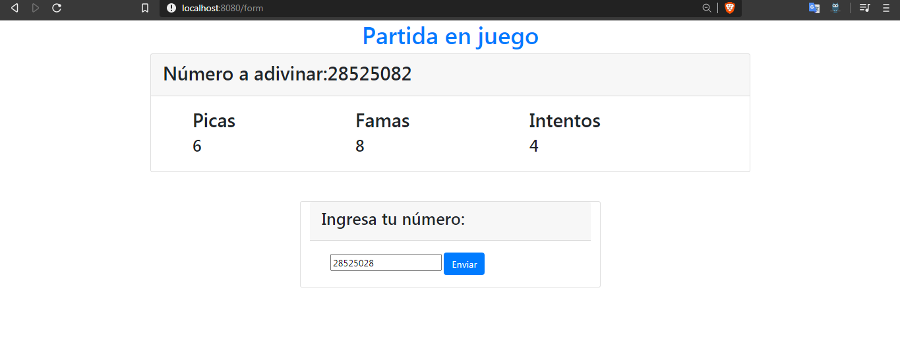
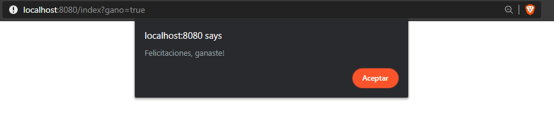
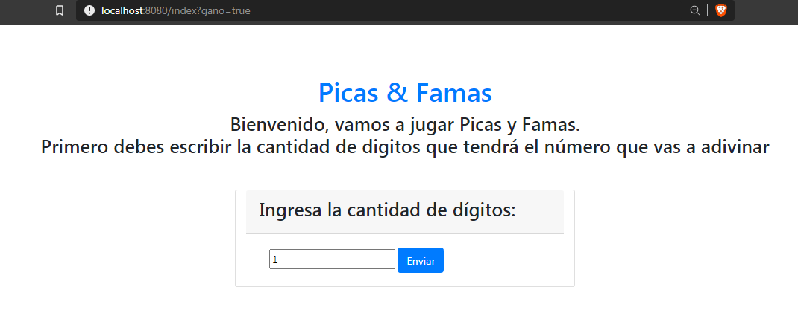

# Picas & Famas

El siguiente repositorio contiene un programa sencillo de una aplicación web sobre el clásico juego de Picas & Famas el cual consiste en adivinar un número de una longitud dada y a medida que se intentan números se van revelando cuales posiciones tiene correctas y cuales números tiene dentro del numero original.

### Prerrequisitos

Para ejecutar con éxito este programa se requiere de los siguientes programas instalados en su máquina.

```
java version: "1.8.0_171"
git version: 2.19.1.windows.1
Apache Maven version: 3.6.3
```

## Instrucciones de uso

Para poder usar el proyecto lo primero que debe realizar es clonar este repositorio utilizando el siguiente comando desde la terminal del S.O que este utilizando:

```
git clone https://github.com/EdKillah/ARSW-Taller5
```
Otra alternativa es descargarlo directamente por formato ZIP en el botón que indica **"Clone or Download".**
Luego debe redirigirse por medio de la terminal al directorio raíz la cual contiene el achivo pom.xml.

Una vez se encuentre en este directorio se debe compilar el programa para esto se debe ejecutar el siguiente comando:

```
mvn package
```
#### Comando para ejecutar:
```
java -cp target/classes com.bolsaideas.springboot.app.SprintBootPicasFamasApplication
```

Una vez compliado  el repositorio completo se encuentra en posibilidad de ejecutar el juego
#### Comando para ejecutar:
```
java -cp target/classes edu.escuelaing.arsw.intro.app.tallernetworking.Http.HttpServer
```
Ahora accediendo a tráves de su navegador web a **localhost:8080/index** o por medio del siguiente link de heroku donde se encuentra desplegado el programa. [Link]([https://picas-famas.herokuapp.com/index](https://picas-famas.herokuapp.com/index)) 

### Capturas del juego

 Las siguientes son algunas imagenes de la ejecución del juego.

Partida en ejecución, con 4/5 intentos y con 8 dígitos acertados y 6 posiciones correctas.

Mensaje de completitud de la partida.

Se redirecciona al index para comenzar una partida nueva.



## Construido con


* [Maven](https://maven.apache.org/) - Dependency Management
* [Spring](https://spring.io/projects/spring-boot) - Framework
* [Java](https://www.java.com/es/download/) - Lenguaje de programación
* [Git](https://github.com/) - Versionamiento


## Authors

* **Eduard Jimenez** - *LOCS/Hora  400/9 = 3.2 LOCS/Hora* - Fecha: 17/06/2020


## Licencia

This project is licensed under the MIT License - see the [LICENSE.md](LICENSE.md) file for details


